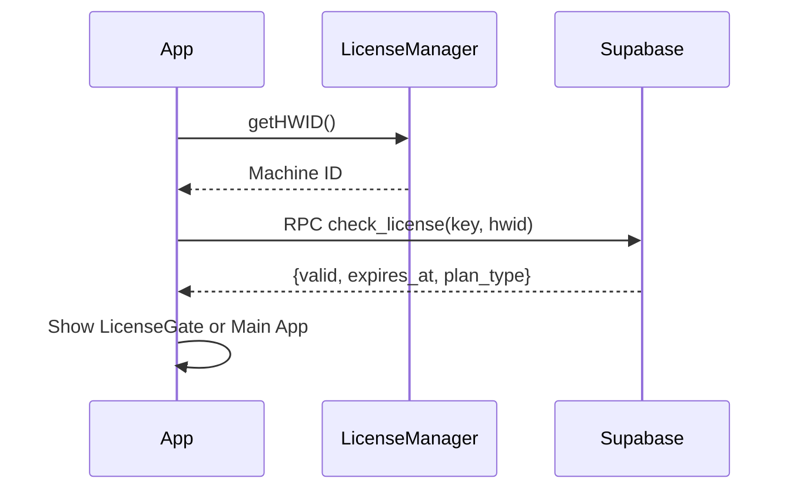
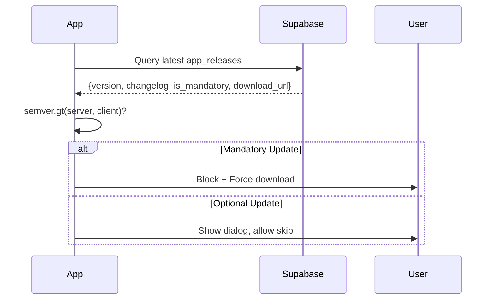

# Veo3 Auto Video Generator

> Ứng dụng desktop tự động tạo video sản phẩm chuyên nghiệp sử dụng AI.

## 📋 Tổng quan

Veo3 Auto Video Generator là ứng dụng Electron giúp tự động hóa quy trình tạo video marketing cho sản phẩm. Ứng dụng sử dụng AI để blend hình ảnh, tạo nhiều góc chụp, và render video chuyên nghiệp.

---

## 🚀 Tính năng chính

### 1. **Tạo Video Tự Động**
- Upload ảnh sản phẩm + ảnh người mẫu
- AI tự động blend 2 ảnh thành Master Image
- Tạo 4 góc chụp khác nhau từ Master Image
- Generate 12 video (3 biến thể/góc)
- Tự động ghép video + thêm nhạc nền

### 2. **Hệ thống License**
- Xác thực bằng HWID (1 key = 1 máy)
- Hỗ trợ các gói: Monthly, Yearly, Lifetime
- Auto-verify khi khởi động app
- Hiển thị thời gian còn lại trong Settings

### 3. **Auto Update**
- Kiểm tra version mới từ Supabase
- Hỗ trợ Mandatory Update (bắt buộc) và Soft Update (tùy chọn)
- So sánh version chuẩn bằng semver

### 4. **Thư viện Video**
- Tự động lưu video sau khi tạo
- Scan thư mục để import video cũ
- Xem/xóa video ngay trong app

### 5. **Settings**
- Cấu hình API Token, Session Token
- Chọn dịch vụ Captcha (YesCaptcha, OMOCaptcha, CapSolver)
- Proxy support
- Output directory

---

## 🛠 Tech Stack

| Layer | Technology |
|-------|------------|
| Frontend | React, TailwindCSS, Lucide Icons |
| Backend | Electron (Node.js) |
| Database | SQLite (sql.js) - Local |
| Cloud | Supabase (License + Updates) |
| Video | FFmpeg (via VideoProcessor) |
| AI APIs | Google Flow (Whisk + Veo) |

---

## 📁 Cấu trúc thư mục

```
product-to-video/
├── src/
│   ├── main/                    # Electron Main Process
│   │   ├── main.js              # Entry point, IPC handlers
│   │   ├── preload.js           # IPC bridge to renderer
│   │   └── services/
│   │       ├── VeoApiService.js     # AI API integration
│   │       ├── VideoProcessor.js    # FFmpeg wrapper
│   │       ├── DatabaseManager.js   # SQLite database
│   │       ├── SettingsManager.js   # App settings
│   │       ├── LicenseManager.js    # License verification
│   │       └── CaptchaSolver.js     # Captcha solving
│   │
│   └── renderer/                # Electron Renderer Process
│       ├── index.html
│       ├── index.css
│       ├── App.jsx              # Main app component
│       └── components/
│           ├── FileSelector.jsx
│           ├── PromptConfig.jsx
│           ├── StepIndicator.jsx
│           ├── VideoGrid.jsx
│           ├── LibraryTab.jsx
│           ├── SettingsTab.jsx
│           ├── LicenseGate.jsx
│           └── ...
│
├── prompt/                      # AI Prompts
│   ├── angle_prompts/           # Prompts for angle generation
│   └── video_prompts/           # Prompts for video generation
│
├── music/                       # Background music files (.mp3)
├── docs/                        # Documentation
├── supabase_license_schema.sql  # License table SQL
├── supabase_releases_schema.sql # App releases table SQL
└── package.json
```

---

## 🔧 Cài đặt

### Prerequisites
- Node.js 18+ (khuyến khích 20+)
- FFmpeg (cho video processing)

### Installation

```bash
# Clone repo
git clone <repo-url>
cd product-to-video

# Install dependencies
npm install

# Copy env file
cp .env.example .env

# Edit .env with your credentials
```

### Environment Variables

```env
# Veo API (Required)
VEO_API_TOKEN=your_oauth_token
VEO_SESSION_TOKEN=your_session_token

# Captcha Service
TWOCAPTCHA_API_KEY=your_captcha_key

# Supabase (License & Updates)
SUPABASE_URL=https://your-project.supabase.co
SUPABASE_ANON_KEY=your_anon_key

# Performance
CONCURRENT_THREADS=4
```

### Development

```bash
npm run dev
```

### Production Build

```bash
npm run build
```

---

## 📊 Database Schema

### Local SQLite

**1. `settings`** - App settings (key-value)
```sql
key TEXT PRIMARY KEY, value TEXT
```

**2. `jobs`** - Workflow history
```sql
id, status, progress, message, created_at, updated_at
```

**3. `videos`** - Video library
```sql
id, job_id, file_path, thumbnail_path, duration, file_size, created_at
```

### Supabase (Cloud)

**1. `licenses`** - License keys
```sql
id, license_key, hwid, plan_type, status, activated_at, expires_at
```

**2. `app_releases`** - Version updates
```sql
id, version, changelog, download_url, is_mandatory, created_at
```

---

## 🔐 License System Flow



**Các trường hợp:**
1. **First Activation**: HWID = NULL → Bind key to device
2. **Valid License**: HWID matches → Allow access
3. **Device Mismatch**: HWID differs → Block access
4. **Expired**: expires_at < NOW → Block access
5. **Banned**: status = 'banned' → Block access

---

## 🔄 Auto Update Flow



---

## 📱 Workflow chính

1. **Input**: User upload Product Image + Person Image
2. **Master Blend**: AI blend 2 images → Master Image
3. **Angle Generation**: Generate 4 angle variants (parallel)
4. **Video Generation**: 3 videos per angle = 12 videos (parallel)
5. **Post-processing**: Cut clips + Concatenate + Add music
6. **Output**: Final video saved to Library

---

## 🎨 UI/UX Design

- **Theme**: Dark glassmorphism
- **Colors**: Primary purple gradient
- **Icons**: Lucide React
- **Animations**: Smooth transitions, hover effects
- **Responsive**: Flexible layouts

---

## 📝 License

Proprietary - All rights reserved.

---

## 👥 Contact

- Developer: TechlaAI
- Support: [Your contact info]
